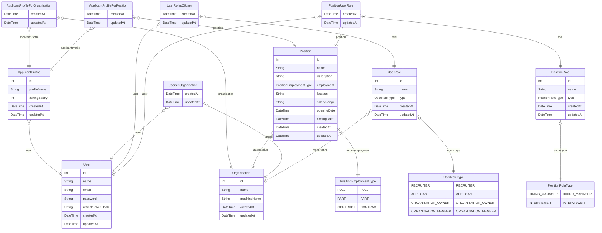

```mermaid
erDiagram

        PositionEmploymentType {
            FULL FULL
PART PART
CONTRACT CONTRACT
        }
    


        UserRoleType {
            RECRUITER RECRUITER
APPLICANT APPLICANT
ORGANISATION_OWNER ORGANISATION_OWNER
ORGANISATION_MEMBER ORGANISATION_MEMBER
        }
    


        PositionRoleType {
            HIRING_MANAGER HIRING_MANAGER
INTERVIEWER INTERVIEWER
        }
    
  User {
      Int id
    String name
    String email
    String password
    String refreshTokenHash
    DateTime createdAt
    DateTime updatedAt
    }
  

  ApplicantProfile {
      Int id
    String profileName
    Int askingSalary
    DateTime createdAt
    DateTime updatedAt
    }
  

  Organisation {
      Int id
    String name
    String machineName
    DateTime createdAt
    DateTime updatedAt
    }
  

  ApplicantProfileForOrganisation {
      DateTime createdAt
    DateTime updatedAt
    }
  

  Position {
      Int id
    String name
    String description
    PositionEmploymentType employment
    String location
    String salaryRange
    DateTime openingDate
    DateTime closingDate
    DateTime createdAt
    DateTime updatedAt
    }
  

  UsersInOrganisation {
      DateTime createdAt
    DateTime updatedAt
    }
  

  ApplicantProfileForPosition {
      DateTime createdAt
    DateTime updatedAt
    }
  

  UserRole {
      Int id
    String name
    UserRoleType type
    DateTime createdAt
    DateTime updatedAt
    }
  

  UserRolesOfUser {
      DateTime createdAt
    DateTime updatedAt
    }
  

  PositionRole {
      Int id
    String name
    PositionRoleType type
    DateTime createdAt
    DateTime updatedAt
    }
  

  PositionUserRole {
      DateTime createdAt
    DateTime updatedAt
    }
  
    ApplicantProfile o{--|| User : "user"
    ApplicantProfileForOrganisation o{--|| ApplicantProfile : "applicantProfile"
    ApplicantProfileForOrganisation o{--|| Organisation : "organisation"
    Position o|--|| PositionEmploymentType : "enum:employment"
    Position o{--|| Organisation : "organisation"
    UsersInOrganisation o{--|| User : "user"
    UsersInOrganisation o{--|| Organisation : "organisation"
    ApplicantProfileForPosition o{--|| ApplicantProfile : "applicantProfile"
    ApplicantProfileForPosition o{--|| Position : "position"
    UserRole o|--|| UserRoleType : "enum:type"
    UserRole o{--|| Organisation : "organisation"
    UserRolesOfUser o{--|| User : "user"
    UserRolesOfUser o{--|| UserRole : "role"
    PositionRole o|--|| PositionRoleType : "enum:type"
    PositionUserRole o{--|| Position : "position"
    PositionUserRole o{--|| User : "user"
    PositionUserRole o{--|| PositionRole : "role"
```
