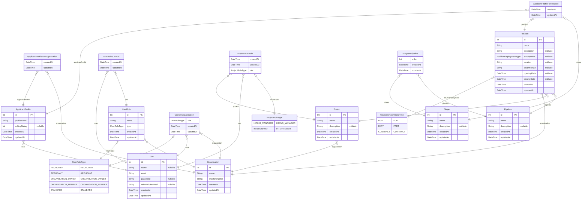

```mermaid
erDiagram

        PositionEmploymentType {
            FULL FULL
PART PART
CONTRACT CONTRACT
        }
    


        UserRoleType {
            RECRUITER RECRUITER
APPLICANT APPLICANT
ORGANISATION_OWNER ORGANISATION_OWNER
ORGANISATION_MEMBER ORGANISATION_MEMBER
STANDARD STANDARD
        }
    


        ProjectRoleType {
            HIRING_MANAGER HIRING_MANAGER
INTERVIEWER INTERVIEWER
        }
    
  User {
    Int id PK 
    String name  "nullable"
    String email  
    String password  "nullable"
    String refreshTokenHash  "nullable"
    DateTime createdAt  
    DateTime updatedAt  
    }
  

  ApplicantProfile {
    Int id PK 
    String profileName  
    Int askingSalary  "nullable"
    DateTime createdAt  
    DateTime updatedAt  
    }
  

  Organisation {
    Int id PK 
    String name  
    String machineName  
    DateTime createdAt  
    DateTime updatedAt  
    }
  

  ApplicantProfileForOrganisation {
    DateTime createdAt  
    DateTime updatedAt  
    }
  

  Project {
    Int id PK 
    String name  
    String description  "nullable"
    DateTime createdAt  
    DateTime updatedAt  
    }
  

  Position {
    Int id PK 
    String name  
    String description  "nullable"
    PositionEmploymentType employment  "nullable"
    String location  "nullable"
    String salaryRange  "nullable"
    DateTime openingDate  "nullable"
    DateTime closingDate  "nullable"
    DateTime createdAt  
    DateTime updatedAt  
    }
  

  UsersInOrganisation {
    UserRoleType role  
    DateTime createdAt  
    DateTime updatedAt  
    }
  

  UserRole {
    Int id PK 
    String name  
    UserRoleType type  
    DateTime createdAt  
    DateTime updatedAt  
    }
  

  UserRolesOfUser {
    DateTime createdAt  
    DateTime updatedAt  
    }
  

  ApplicantProfileForPosition {
    DateTime createdAt  
    DateTime updatedAt  
    }
  

  ProjectUserRole {
    DateTime createdAt  
    DateTime updatedAt  
    ProjectRoleType role  
    }
  

  Stage {
    Int id PK 
    String name  
    String description  "nullable"
    DateTime createdAt  
    DateTime updatedAt  
    }
  

  Pipeline {
    Int id PK 
    String name  
    String description  "nullable"
    DateTime createdAt  
    DateTime updatedAt  
    }
  

  StagesInPipeline {
    Int order  
    DateTime createdAt  
    DateTime updatedAt  
    }
  
    ApplicantProfile o{--|| User : "user"
    ApplicantProfileForOrganisation o{--|| ApplicantProfile : "applicantProfile"
    ApplicantProfileForOrganisation o{--|| Organisation : "organisation"
    Project o{--|| Organisation : "organisation"
    Position o|--|| PositionEmploymentType : "enum:employment"
    Position o{--|| Organisation : "organisation"
    Position o{--|| Project : "project"
    Position o{--|| Pipeline : "pipeline"
    UsersInOrganisation o|--|| UserRoleType : "enum:role"
    UsersInOrganisation o{--|| User : "user"
    UsersInOrganisation o{--|| Organisation : "organisation"
    UserRole o|--|| UserRoleType : "enum:type"
    UserRole o{--|| Organisation : "organisation"
    UserRolesOfUser o{--|| User : "user"
    UserRolesOfUser o{--|| UserRole : "role"
    ApplicantProfileForPosition o{--|| ApplicantProfile : "applicantProfile"
    ApplicantProfileForPosition o{--|| Position : "position"
    ApplicantProfileForPosition o{--|| Stage : "stage"
    ProjectUserRole o{--|| Project : "project"
    ProjectUserRole o{--|| User : "user"
    ProjectUserRole o|--|| ProjectRoleType : "enum:role"
    StagesInPipeline o{--|| Stage : "stage"
    StagesInPipeline o{--|| Pipeline : "pipeline"
```
